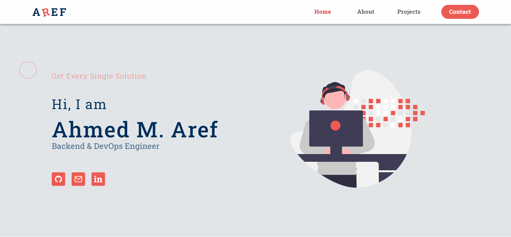
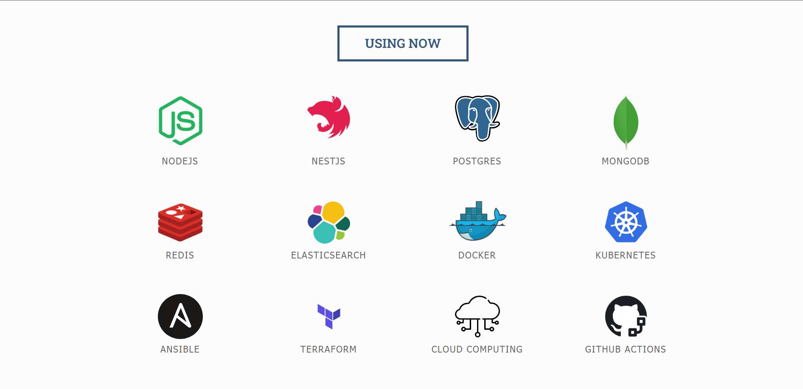

# Ahmed Aref's Portfolio

Welcome to my portfolio! This repository showcases my skills and projects as a software engineer. It includes examples of my work in backend developand DevOps.

## Running the Application

To get the application up and running on your local machine, follow these steps:

1. **Prerequisites**: Ensure Docker is installed on your system.
2. **Clone the Repository**
3. **Navigate to the Project Directory**
4. **Launch the Application**:

   ```bash
   docker-compose up
   ```
5. **Access the App**:
   Open your web browser and go to [http://localhost:3000](http://localhost:3000) to view the portfolio.

## Examples from Pages




